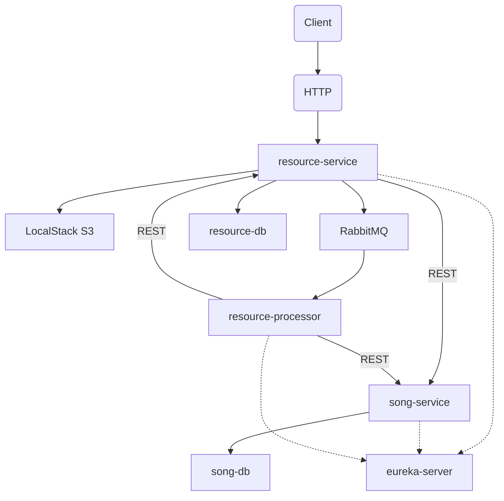

# Microservice Testing Strategy

## Overview

This document outlines the comprehensive testing strategy for the microservice architecture comprising:
- **resource-service**: File upload, S3 storage, message publishing
- **song-service**: Song metadata management
- **resource-processor**: Async file processing via RabbitMQ
- **eureka-server**: Service discovery

---

## Architecture Context



## Testing Pyramid Distribution

| Test Type | Coverage Target | Execution Time | Frequency |
|-----------|-----------------|---------------|-----------|
| Unit Tests | 70-80% | Seconds | Every commit |
| Integration Tests | 15-20% | Minutes | Every PR |
| Component Tests | 5-10% | Minutes | Every PR |
| Contract Tests | 100% APIs | Minutes | Every PR |
| E2E Tests | Critical paths | 10-15 min | Nightly/Release |

## 1. Unit Tests

### Purpose
Test individual classes and methods in isolation to verify business logic correctness.

### Approach
- **Target**: Service layer business logic, DTO mappings, utility classes, validators
- **Framework**: JUnit 5 + Mockito
- **Mocking**: All external dependencies (database, REST clients, message producers)

### What to Test
- [ ] Service layer business logic
- [ ] DTO mappers (Entity ↔ DTO conversions)
- [ ] Custom validators
- [ ] Exception throwing logic
- [ ] Retry and circuit breaker configurations
- [ ] Utility methods

## 2. Integration Tests

### Purpose
Test how components work together with real infrastructure (database, message broker).

### Approach
- **Target**: Repository layer, messaging producers/consumers
- **Framework**: Spring Boot Test with Testcontainers
- **Infrastructure**: PostgreSQL, RabbitMQ containers

### What to Test
- [ ] Repository CRUD operations with real database
- [ ] Database transactions and rollback
- [ ] JPA/Hibernate entity mappings
- [ ] RabbitMQ message publishing
- [ ] Message listener deserialization

## 3. Component Tests

### Purpose
Test individual services in isolation with external dependencies mocked or replaced with test doubles.

### Approach
- **Target**: REST controllers, full service stack
- **Framework**: Spring Boot Test with `@WebMvcTest`, `@DataJpaTest`, `@RabbitListenerTest`
- **Scope**: Single service, mocked external calls

### Implementation Details

### What to Test
- [ ] REST controller endpoints (HTTP status, response body, validation)
- [ ] Request/response DTO serialization
- [ ] Exception handling
- [ ] Validation annotations
- [ ] Security (if applicable)

## 4. Contract Tests

### Purpose
Ensure service APIs adhere to agreed contracts, enabling independent service evolution.

### Approach
- **Framework**: Spring Cloud Contract (Pact alternative)
- **Scope**: Consumer-driven contracts for REST APIs

### Running Contract Tests

For detailed information about contract testing implementation and configuration, see [Contract Testing Documentation](contract-testing.md).

To run contract tests:

```bash
# Run contract tests for all services
mvn verify -DskipTests=false

# Run for specific service
cd resource-service && mvn verify -DskipTests=false
cd resource-processor && mvn verify -DskipTests=false
```

### Contract Points

| Producer | Consumer | Contract |
|----------|----------|----------|
| song-service | resource-processor | POST /api/songs |
| song-service | resource-service | DELETE /api/songs |
| resource-service | resource-processor | GET /api/resources/{id}/data |

### What to Test
- [ ] Request/response structure validation
- [ ] Field types and formats
- [ ] Required vs optional fields
- [ ] HTTP status codes
- [ ] Error response schemas

## 5. End-to-End Tests

### Purpose
Verify complete business flows across all services in a realistic environment.

### Approach
- **Framework**: TestContainers + RestAssured / Custom HTTP client
- **Environment**: Full Docker Compose stack
- **Scope**: Critical user journeys

### Prerequisites

Before running E2E tests, the full stack must be started manually:

```bash
# Start all services
docker compose up -d

# Verify all containers are running
docker compose ps
```

Wait for all services to be healthy before executing tests.

### Running E2E Tests

```bash
# Run all E2E tests
cd e2e-tests
mvn test

# Run specific tag
mvn test -Dcucumber.filter.tags="@e2e and @happy-path"
```

### Critical Paths to Test

| Flow | Description |
|------|-------------|
| File Upload | Upload MP3 → S3 → DB → Message → Processing → Metadata saved |
| File Download | Request → S3 fetch → Return file |
| Batch Delete | Delete request → S3 cleanup → DB cleanup → Metadata cleanup |

## Summary

The recommended testing distribution for this microservice architecture:

- **70-80% Unit Tests**: Fast feedback, isolated logic testing
- **15-20% Integration Tests**: Database and messaging infrastructure validation
- **5-10% Component Tests**: REST API contract validation within services
- **Contract Tests**: 100% of API endpoints covered
- **E2E Tests**: Critical business flows only (3-5 scenarios)

This approach ensures:
1. **Fast feedback loop** for developers (unit tests run in seconds)
2. **Reliable integration points** (contract + integration tests)
3. **Confidence in production** (E2E tests validate critical paths)
4. **Independent deployability** (contract tests prevent breaking changes)
5. **Infrastructure confidence** (integration tests validate DB/messaging)

The combination of these testing strategies provides comprehensive coverage while maintaining reasonable execution times at each stage of the development lifecycle.
